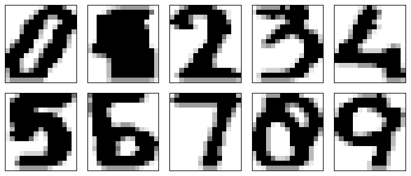
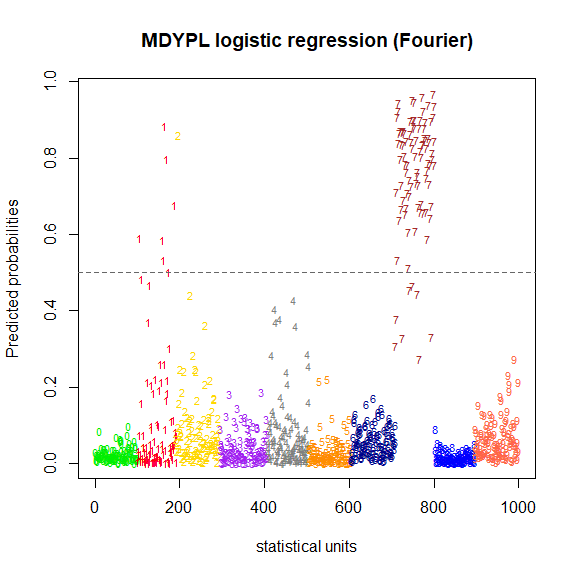
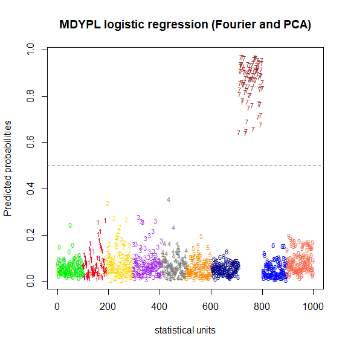
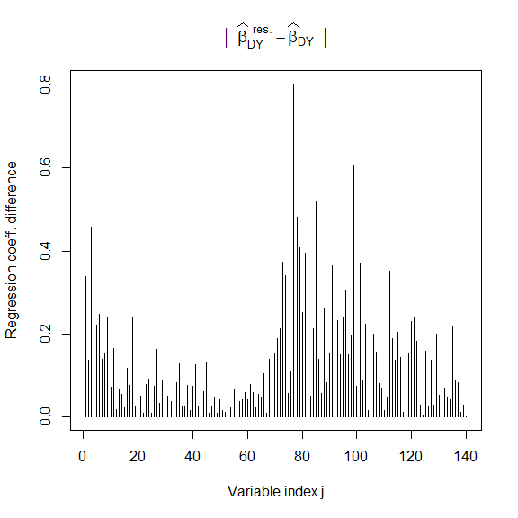
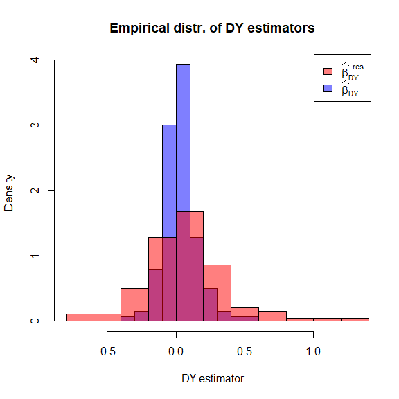
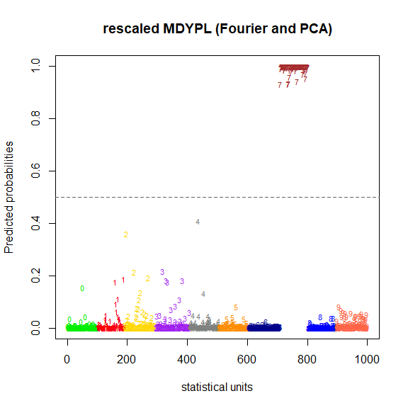
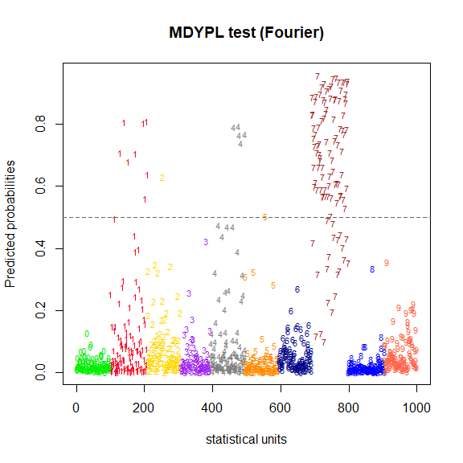
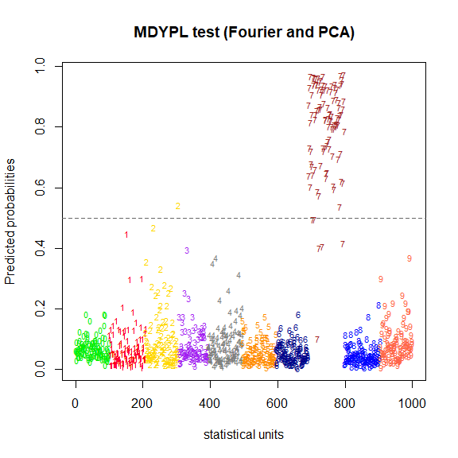
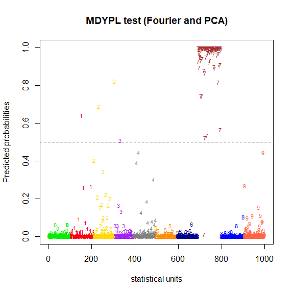
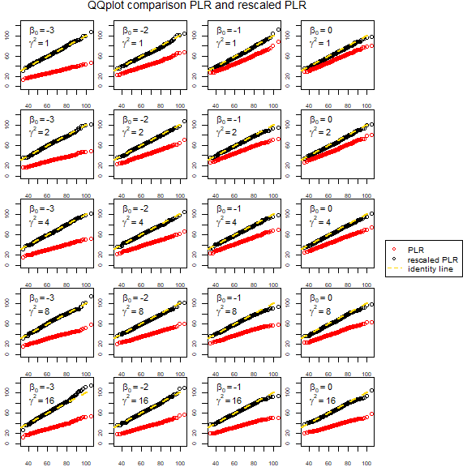

Image recognition: case study
================
[Federico Boiocchi](https://github.com/federicoboiocchi)
29 August 2025

## Motivation:

In many real word scenarios it is of interest to understand and classify
the content of an image in a fully automated way. Over the years, Image
and pattern recognition problems have become progressively more
difficult to solve requiring as a consequence increasingly more advanced
statistical models. This vignette deals with the problem of
**handwritten digit recognition**

## Model:

A possible way to approach image recognition consists of using
**logistic regression**, a widely known generalized linear model, that
allows to model a transformation of the conditional expected value of a
binary response $y$ with a linear combination of explanatory variables
$\mathbf{X}\boldsymbol{\beta}$: 

$$
\text{responses sample}\quad (y_1,\dots,y_n)\sim \text{Ber}(\mu_i)\quad\text{with}\ i=1,\dots,n\quad \text{and}\ \underset{n \times p}{\mathbf{X}},\quad
\mathbb{E}[Y_i\ |\ \mathbf{x}_i^\top]=\mu_i=g^{-1}(\mathbf{x}_i^\top\boldsymbol{\beta})\quad\text{with}\ g^{-1}(\cdot)=\frac{\text{exp}(\cdot)}{1+\text{exp}(\cdot)}
$$

Differently from black box algorithms, two main advantages of such
method are the statistical interpretability of the quantities involved,
and a well developed inferential theory related for model parameters. In
this context, logistic regression can be used as a binary classifier to
associate to each image a probability that it contains a certain element
of interest provided that the GLM has been estimated on correctly
labelled data.

## Objective:

The primary purpose of this analysis, inspired to the case study in [P.
Sterzinger, I. Kosmidis](https://arxiv.org/abs/2311.07419), is to show
through a real data application how to use the new features of
[**brglm2**](https://github.com/ikosmidis/brglm2) that allows to perform
**Diaconis-Ylvisaker** penalized logistic regression and highlight the
strength points of using this statistical model for binary
classification problems. At the same time we will illustrate empirically
the results in *Theorem 3.1* and *3.5* of [P. Sterzinger, I.
Kosmidis](https://arxiv.org/abs/2311.07419) .

## Dataset:

Importing the data needed for the analysis

``` r
mfeat.fou <- read.table("C:/Users/andre/Downloads/multiple+features/mfeat-fou",sep = "")
mfeat.kar <- read.table("C:/Users/andre/Downloads/multiple+features/mfeat-kar",sep = "")
mfeat.pix <- read.table("C:/Users/andre/Downloads/multiple+features/mfeat-pix",sep = "")
```

We are using the [**Multiple
features**](https://archive.ics.uci.edu/dataset/72/multiple+features)
dataset from UCI machine learning repository. The structure of the
dataset is the following:

- **Digit images**: 2000 images of handwritten digits from 0 to 9, for
  each digit exactly 200 images are available. These pictures consist of
  15 x 16 grid of pixels (each pixel takes value in $\{0,1,...,6\}$) the
  pixel values for each image are stored by row in a matrix with
  dimensions 2000 x 240. Additionally, the images are arranged such that
  the first 200 rows correspond to zeros, the next 200 to ones, and so
  on up to nines. The following is a sample of ten digits one from each
  class. Depending on the font and level of noise in the digitisation
  phase, difficulties may arise in classifying them.

<!-- -->

- **Explanatory variables**: the dataset includes several explanatory
  variable, however in this analysis we will primary focus on the values
  of **Fourier** coefficients for each image and the values of the
  **Principal component scores** (or *Karhunen-Loeve* coefficients).
  Specifically 64 PC scores and 76 Fourier coefficients are available.
- **Karhunen-Loeve** coefficients is an alternative way of referring to
  **PCA scores** which are the coordinates of the data points in the
  space of variables when a change of basis is performed in order to
  have maximum variance along each orthogonal direction in the cloud of
  data points. In this case the matrix of data is considered to be the
  grid of pixel values for each image. It is not clear to which
  component each PC score refer to.
- **Fourier coefficients** $C(u,v)$ are the weights of linear
  combinations of two-dimensional cosine and sine waves that added
  together reconstruct each one of the images. Each Fourier coefficient
  corresponds to a horizontal and vertical frequency of the wave
  $(u,v)$, and thus indicates the importance of a particular pattern
  within the image. The intuition is that each pixel value $f(x,y)$ in
  the image can be approximated with a linear combination of cosine and
  sine waves:
  
  $$f(x,y)=\underset{u,v}{\sum}C(u,v)e^{i2\pi\left(\displaystyle\frac{ux}{M}+\frac{vy}{N}\right)}$$
  
  This is also known as fourier decomposition of an image.
- **Binary response**: a label taking value either 0 or 1, indicating
  whether the image contains a specific, arbitrarily chosen digit. Since
  we know the ground truth for all digits we will be able to assess the
  accuracy of the final classification.

## Problem:

We arbitrarily decide that we are interested in detecting the number 7
(the entire analysis could have been reproduced with another number);
Once the training and test sets are randomly defined from the complete
matrix of data, we define the binary response $y$ as 1 if the image in
the training is a 7 or 0 otherwise. The goal will be to correctly
predict images in the test set. We will then compare the predicted
probabilities for each digit class using **MDYPL logistic regressions**,
both with and without parameter rescaling, and with covariates given by
Fourier scores alone or by both Fourier and PCA scores. The comparsion
of the models with different explanatory variables will be carried out
both empirically and via *Likelihood ratio test*.

We upload the functions needed to perform mdypl logistic regression
before **brglm2** is actually updated (after the update it will be
possible to just upload brglm2 through `library(brglm2)`)

``` r
source("solve_se.R")
source("se.R")
source("utils.R")
source("mdyplFit.R")
library("statmod") # to define Gauss-Hermite nodes
library("nleqslv") # to find the solution for the state evolution system
library(latex2exp) # to manage labels written in latex
```

``` r
# 2000 x 76 matrix of Fourier coefficients
fou <- mfeat.fou 
# 2000 x 64 matrix of Karhunen-Loeve coefficients
kar <- mfeat.kar
# ground truth labels (ordered from 0 to 9)
pix <- rep(c(0:9),each=200)
ind01 <- numeric(2000)
```

``` r
#renaming the Fourier coefficients covariates
colnames(fou) <- paste("fou", 1:76, sep = "")
#renaming the Karhunen-Loeve coefficients covariates
colnames(kar) <- paste("kar",1:64,sep = "")
```

``` r
# binary response (ground truth labels: 0,1)
digit_of_interest <- 7
ind01[which(pix==digit_of_interest)] <- 1 
```

by changing `digit_of_interest` the whole analysis can be performed for
other digits.

``` r
data <- cbind(pix,ind01,fou,kar)
```

Training test split

``` r
# set seed to have a reproducible analysis
set.seed(123)
train_id <- sort(sample(c(1:2000),size=1000,replace=FALSE))
train <- data[train_id,]
pix_tr <- pix[train_id]

test <- data[-train_id,]
pix_ts <- pix[-train_id]
```

## Analysis

**TRAINING SET**

``` r
# definition of the training design matrix by removing the labels
X_tr <- as.matrix(train[,-c(1,2)])
# standardization of the variables
X_tr_std <- scale(X_tr,center=TRUE,scale=TRUE)
# response variable (available for the training)
y_tr <- as.matrix(train[,2])
```

## High-dimensional Maximum Diaconis-Ylvisaker penalized logistic regression

We will use the following logistic regression model: 

$$
\mathbb{P}(y_i=1\ |\ \mathbf{x}_i^\top )= \frac{1}{1+\text{exp}(-\mathbf{x}_i^\top\boldsymbol{\beta})}\qquad \text{for}\ \  i = 1,\dots,1000\\
$$

where $y_i$ is the label indicating wheter the image is a 7 or not
and the linear predictor includes both Fourier coefficients and PCA
scores or only Fourier coefficients depending on the model used. Since
we are using a *Diaconis-Ylvisaker* penalized logistic regression, the
estimator of the regression coefficients has the following form: 

$$
\widehat{\boldsymbol{\beta}}_{\text{DY}}=\underset{\boldsymbol{\beta}\in\mathbb{R}^p}{\text{argmax}}\ l(\boldsymbol{\beta};\mathbf{y},\mathbf{X})+\text{ln}(\pi(\boldsymbol{\beta}))\quad \text{with}\quad \pi(\beta)\sim \text{DY}(\alpha,\boldsymbol{\beta}_p),
$$ 

where $l(\boldsymbol{\beta};\mathbf{y},\mathbf{X})$ represents the
log-likelihood of a sample of Bernoulli whose mean is modeled with the
inverse logit of a linear predictor; while
$\text{ln}(\pi(\boldsymbol{\beta}))$ represents the natural logarithm of
the *Diaconis-Ylvisaker* prior. This prior depends on two parameters:
$\alpha$, which is the shrinkage parameter, and $\boldsymbol{\beta}_p$,
the mode of the prior, which is usually set to $\mathbf{0}$ if not
otherwise specified.

Computationally speaking, the DY penalized log-likelihood is equivalent
to that of a standard logistic regression applied to transformed
responses. Consequently, a standard Fisher–Scoring algorithm can be
applied to these pseudo-responses.

**Method mdyplFit for logistic regression in `glm`**

We compute the model by using the standard `glm()` function but using a
non-standard method, namely, `method = mdyplFit`. The output will be an
object of class glm, that will inherit all the features of a classic glm
object but computed with a new fitter.

`mod_fk` stands for model with all Fourier and PC scores coefficients as
explanatory variables. An intercept is also included in the model.

``` r
# MDYPL logistic regression: Intercept + Fourier + PC scores
mod_fk <- glm(y_tr ~ X_tr_std, family = binomial(), method = "mdyplFit") 
# summary of the object of class glm with method = mdyplFit
(summ_fk <- summary(mod_fk))
s <- capture.output(summ_fk)
cat(head(s, 18), sep = "\n")
cat("...\n")
cat(tail(s, 20), sep = "\n")

#> Call:
#> glm(formula = y_tr ~ X_tr_std, family = binomial(), method = "mdyplFit")
#>
#> Deviance Residuals: 
#>    Min       1Q   Median       3Q      Max  
#> -0.9399  -0.4174  -0.3341  -0.2480   0.9397  
#>
#> Coefficients:
#>                Estimate Std. Error z value Pr(>|z|)    
#> (Intercept)   -2.3491346  0.1320712 -17.787   <2e-16 ***
#> X_tr_stdfou1   0.2242358  0.2802190   0.800    0.424    
#> X_tr_stdfou2  -0.0901030  0.3427133  -0.263    0.793    
#> X_tr_stdfou3   0.3029658  0.2608591   1.161    0.245    
#> X_tr_stdfou4   0.1842861  0.2032689   0.907    0.365    
#> X_tr_stdfou5  -0.1464839  0.3770292  -0.389    0.698    
#> X_tr_stdfou6  -0.1639585  0.2422420  -0.677    0.499    
#> X_tr_stdfou7   0.0921854  0.3402478   0.271    0.786    
#> ...
#> X_tr_stdkar56  0.0465789  0.1880955   0.248    0.804    
#> X_tr_stdkar57 -0.0315085  0.1871347  -0.168    0.866    
#> X_tr_stdkar58  0.0273410  0.1878315   0.146    0.884    
#> X_tr_stdkar59  0.1445634  0.1629674   0.887    0.375    
#> X_tr_stdkar60 -0.0591732  0.1926804  -0.307    0.759    
#> X_tr_stdkar61 -0.0551500  0.1658793  -0.332    0.740    
#> X_tr_stdkar62 -0.0077934  0.1722651  -0.045    0.964    
#> X_tr_stdkar63  0.0187850  0.1668718   0.113    0.910    
#> X_tr_stdkar64 -0.0006928  0.1650868  -0.004    0.997    
#> ---
#> Signif. codes:  0 ‘***’ 0.001 ‘**’ 0.01 ‘*’ 0.05 ‘.’ 0.1 ‘ ’ 1
#>
#> (Dispersion parameter for binomial family taken to be 1)

#> Null deviance: 618.85  on 999  degrees of freedom
#> Residual deviance: 159.10  on 859  degrees of freedom
#> AIC:  663.69
#>
#> Type of estimator: MPL_DY (maximum Diaconis-Ylvisaker prior penalized likelihood) with alpha = 0.88
#> Number of Fisher Scoring iterations: 6
```

In low-dimensional setting when the high dimensional correction
(`hd_correction`) is not required $\hat{{\beta}}_{DY}$  
behaves as a ML estimator and  therefore the quantities   in the `summary` above  such as    
the standard errors, the z values and
the p-values are computed in the classical way. On the contrary the
summary will be different when including the `hd_correction`.

``` r
# Regression coefficients of the full model (Fourier and PCA), intercept included
b_fk <- coef(mod_fk) 
ones <- rep(1,1000)
```

`b_fk` corresponds to the `Estimate` column in the `summary`

Linear predictor (important to take in to account the intercept column)

``` r
eta_fk <- cbind(ones,X_tr_std)%*%b_fk  
```

It’s worth noting that especially in an high-dimensional context, the
shrinkage property of the hyperparameter $\alpha$ of the DY prior makes
the estimated regression coefficients
$\widehat{\boldsymbol{\beta}}_{\text{DY}}$ biased away from their real
values $\boldsymbol{\beta}$. Therefore they will need to be corrected
using the solution of the state evolution system.

We also estimate a model with only the Fourier coefficients and the
intercept

``` r
# MDYPL logistic regression: Intercept + Fourier
mod_f <- glm(y_tr ~ X_tr_std[,1:76], family = binomial(), method = "mdyplFit") 
# regression coefficients
b_f <- coef(mod_f)
# linear predictor
eta_f <-  cbind(ones,X_tr_std[,1:76])%*%b_f 
```

Inverse logit function used to compute predicted probabilities

``` r
link <- function(x){
  1/(1+exp(-x))
}
```

Predicted probabilities on the training set for all 1000 images using
the model with Fourier and Karhunen-Loeve as explanatory variables and
then only Fourier.

``` r
probs_fk <- link(eta_fk)
probs_f <- link(eta_f)
```

Equivalently they could have been computed using the the built-in
function `fitted()`.

``` r
fitted_prob_fk <- fitted(mod_fk)
fitted_prob_f <- fitted(mod_f)
```

Checking whether `fitted()` works as expected

``` r
all(round(probs_fk,12)==round(fitted_prob_fk,12))
#> [1] TRUE
all(round(probs_f,12)==round(fitted_prob_f,12))
#> [1] TRUE
```

## Graph of predicted probabilities vs statistical units clustered by digit

``` r
size<-0.7 # font size
my_colors <- c("green2","red","gold","purple","grey50","darkorange","darkblue","brown","blue","tomato")
```

We create a function that plots predicted probability vs statistical
units both for the training and test set.

``` r
pp <- function(probs,pix,df,title){
  plot(c(1:1000), probs, type = "n",main=title,xlab="statistical units",ylab="Predicted probabilities")
  
  for(i in 0:9){
    indices <- which(pix==i)
    text(indices,probs[indices], labels = t(df[indices,1]), cex = size, col = my_colors[i+1])
  }
  abline(h=0.5,col="grey40",lty="dashed",lwd=1.5)
}
```

**MDYPL predicted probabilities using Fourier coefficients (training)**

``` r
pp(probs_f,pix_tr,train,"MDYPL logistic regression (Fourier)")
```

<!-- -->

**MDYPL predicted probabilities using Fourier and Karhunen-Loeve
coefficients (training)**

``` r
pp(probs_fk,pix_tr,train,"MDYPL logistic regression (Fourier and PCA)")
```

<!-- -->

We can observe that while the full model classifies the digit 7
perfectly, the model using only Fourier coefficients does not. It
assigns high predicted probabilities of being a 7 to images that are
actually 1s, 2s, and 4s. This is likely due to the similar patterns
among these four digits, which result in similar feature values and make
it difficult to distinguish between them.

**Rescaled mdypl predicted probabilities (Fourier + Karhunen-Loeve
coefficients)**

**Hd correction details:**

In order to rescale the estimates we need to solve the state evolution
system derived from [**Approximate Message
Passing**](https://arxiv.org/abs/2105.02180) (AMP) theory. We do this by
specifying inside the `summary()` argument `hd_correction = TRUE`, this
option solves the SE system and returns the corrected DY estimates of
the regression coefficients, corrected z values, standard errors and
p-values. In this case since we have included an intercept, the state
evolution system to be solved has 4 equations in 4 unknowns
$(\mu,b,\sigma,\iota)$. The SE system in order to be solved requires
three parameter to be inputed $(k,\gamma,\theta_0)$. $k$ is estimated
with $p/n$. While since we do not know the value of the signal strength
$\gamma$ we approximate it with a known transformation of the **SLOE**
estimator [S. Yadlowsky et al. 2021](https://arxiv.org/abs/2103.12725)
of the corrupted signal strenght. This operation is done by specifying
`corrupted = TRUE`. Moreover, we supply to $\iota$ the estimated
intercept $\hat{\theta_0}^{\text{DY}}$ and solve the system with respect
to $(\mu,b,\sigma,\theta_0)$. This approach turns out to be more
accurate, than supplying $\theta_0$ and solve the system with respect of
$\iota$. On the contrary in the case of `corrupted = FALSE` (and
presence of an intercept) both the oracle value of the intercept and the
true signal strength $\gamma$ have to be supplied. In that case the SE
system is solved with respect to $(\mu,b,\sigma,\iota)$.

``` r
# The summary function computes the rescaling and solves the state evolution system
(summ_res <- summary(mod_fk,hd_correction=TRUE,corrupted=TRUE))
cat(head(s_res, 18), sep = "\n")
cat("...\n")
cat(tail(s_res, 20), sep = "\n")

#> 
#> Call:
#> glm(formula = y_tr ~ X_tr_std, family = binomial(), method = "mdyplFit")
#> 
#> Deviance Residuals: 
#>      Min        1Q    Median        3Q       Max  
#> -1.02673  -0.12115  -0.06795  -0.03163   0.37986  
#> 
#> Coefficients:
#>                Estimate Std. Error z value Pr(>|z|)   
#> (Intercept)   -4.791772         NA      NA       NA   
#> X_tr_stdfou1   0.563662   0.360084   1.565   0.1175   
#> X_tr_stdfou2  -0.226492   0.418043  -0.542   0.5880   
#> X_tr_stdfou3   0.761566   0.324401   2.348   0.0189 * 
#> X_tr_stdfou4   0.463240   0.244679   1.893   0.0583 . 
#> X_tr_stdfou5  -0.368217   0.465631  -0.791   0.4291   
#> X_tr_stdfou6  -0.412143   0.300083  -1.373   0.1696   
#> X_tr_stdfou7   0.231727   0.431727   0.537   0.5914
#> ...
#> X_tr_stdkar61 -0.138631   0.213248  -0.650   0.5156   
#> X_tr_stdkar62 -0.019590   0.225923  -0.087   0.9309   
#> X_tr_stdkar63  0.047220   0.213262   0.221   0.8248   
#> X_tr_stdkar64 -0.001741   0.215032  -0.008   0.9935   
#> ---
#> Signif. codes:  0 '***' 0.001 '**' 0.01 '*' 0.05 '.' 0.1 ' ' 1
#> 
#> (Dispersion parameter for binomial family taken to be 1)
#> 
#>     Null deviance: 618.85  on 999  degrees of freedom
#> Residual deviance:  21.78  on 859  degrees of freedom
#> AIC:  925.38
#> 
#> Type of estimator: MPL_DY (maximum Diaconis-Ylvisaker prior penalized likelihood) with alpha = 0.88
#> Number of Fisher Scoring iterations: 6
#> 
#> High-dimensionality correction applied with
#> Dimentionality parameter (kappa) = 0.14
#> Estimated signal strength (gamma) = 11.71
#> State evolution parameters (mu, b, sigma) = (0.4, 1.83, 2.2) with max(|funcs|) = 5.630178e-09
```

``` r
# Rescaled regression coeff according to the solution of SE system
b_fk_res <- coef(summ_res)[,"Estimate"]
```

As we can observe this summary is different from the one without
correction and the reason lies in the adjustments performed using the
solution of the state evolution system. The difference can be seen in
the following graphs, where the intercept has been removed,due to its
different order of magnitude, in order to allow for a meaningful
comparison:

<!-- --><!-- -->

``` r
# scaled linear predictor
eta_fk_res <- cbind(ones,X_tr_std)%*%b_fk_res  
# scaled linear predictor
probs_fk_res <- link(eta_fk_res)
```

**MDYPL predicted probabilities using Fourier and Karhunen-Loeve
coefficients (training)**

``` r
pp(probs_fk_res,pix_tr,train,"rescaled MDYPL (Fourier and PCA)")
```

<!-- -->

## TEST SET

``` r
# design matrix of the test set (removed labels)
X_ts <- as.matrix(test[,-c(1,2)])
# response in the test set (used only to measure the accuracy of the classification)
y_ts <- test[,2]
```

The standardization of the test design matrix is performed after the
splitting phase in order not to include information from the training
set.

``` r
X_ts_std <- scale(X_ts,center=TRUE,scale=TRUE)
```

Linear predictors of the model with both subsets of covariates
(**Fourier** and **PCA**) and with and without rescaling and only
**Fourier** no rescaling.

``` r
eta_fk_res <- cbind(ones,X_ts_std)%*%b_fk_res
eta_fk <- cbind(ones,X_ts_std)%*%b_fk  
eta_f <-  cbind(ones,X_ts_std[,1:76])%*%b_f 
```

Predicted probabilities

``` r
probs_fk_res <- link(eta_fk_res)
probs_fk <- link(eta_fk)
probs_f <- link(eta_f)
```

**MDYPL predicted probabilities using Fourier coefficients (test)**

``` r
pp(probs_f,pix_ts,test,"MDYPL test (Fourier)")
```

<!-- -->
**MDYPL predicted probabilities using Fourier and Karhunen-Loeve
coefficients (test)**

``` r
pp(probs_fk,pix_ts,test,"MDYPL test (Fourier and PCA)")
```

<!-- -->

**MDYPL predicted probabilities using Fourier and Karhunen-Loeve
coefficients rescaled signal(test)**

``` r
pp(probs_fk_res,pix_ts,test,"MDYPL test (Fourier and PCA)")
```

<!-- -->

As expected, the overall performance on the test set is worse than that
on the training set. More interestingly, the model that includes both
subsets of covariates performs better in classifying the digit 7 and,
more generally, across all digit classes. Moreover, as one would
anticipate from empirical observation, the classifier has difficulties
distinguishing between the digits 7, 4, and 1, due to their strong
similarity in handwritten form. We also observe that performance
improves when the regression coefficients are rescaled according to the
solution of the SE system $(\mu_{\*},b_{\*},\sigma_{\*},\theta_{0*})$. The
corrected estimates are defined as follows:

$$
\hat{\beta_{DY}}^{RES}= \frac{\hat{\beta_{DY}}}{\mu_{\*}}
$$

where the nonlinear system is the one specified in section 6 of [P.
Sterzinger, I. Kosmidis](https://arxiv.org/abs/2311.07419).

## Performance comparison

``` r
# predicted labels
pred_lab_fk_res <- ifelse(probs_fk_res>0.5,1,0)
pred_lab_fk <- ifelse(probs_fk>0.5,1,0)
pred_lab_f <- ifelse(probs_f>0.5,1,0)

# accuracy function 
acc <- function(x,y){
  out <- sum(x==y)/length(x)
}
accuracy_fk_res <- acc(y_ts,pred_lab_fk_res)
accuracy_f <- acc(y_ts,pred_lab_f)
accuracy_fk <- acc(y_ts,pred_lab_fk)
```

    #>   res_fk   Fou Fou_Kar
    #> 1  0.995 0.964   0.993

## Likelihood ratio tests

Empirically, the model using both **Fourier** and **Karhunen–Loève**
coefficients outperforms the model that relies solely on Fourier
coefficients. Therefore, in terms of **hypothesis testing** we expect to
find evidence against the fact that the model with only **Fourier**
coefficients is better than the one with both subsets of features.

Computation of Likelihood ratio statistics

``` r
k <- dim(X_tr)[2]/dim(X_tr)[1]
alpha <- 1/(1+k)

mod_f <- glm(y_tr ~ X_tr_std[,1:76],family=binomial(),method="mdyplFit",alpha=alpha)
mod_fk <- glm(y_tr ~ X_tr_std,family=binomial(),method="mdyplFit",alpha=alpha)

(PLR <- 2*(as.numeric(logLik(mod_fk))-as.numeric(logLik(mod_f))))
#> [1] 64.35935
```

**Penalized Likelihood Ratio test statistics (PLR)**

The PLR has the following form: 

$$
\Lambda_{I}= \underset{\boldsymbol{\beta}\in\mathbb{R}^p}{\sup}\ l(\boldsymbol{\beta};\mathbf{y},\mathbf{X})-\underset{\beta_j=0\ ,\ j\in I}{\underset{\boldsymbol{\beta}\in\mathbb{R}^p}{\sup}}\ l(\boldsymbol{\beta};\mathbf{y},\mathbf{X})
$$

The Hypotesis test we are interested in is the following 

$$
H_0: \Lambda_{\text{pop}}=0\qquad\text{vs}\qquad H_1: \Lambda_{\text{pop}}\neq0
$$

An alternative way of writing the same Hypothesis test system is the
following: 

$$
H_0: \boldsymbol{\beta}\in \{\boldsymbol{\beta}\in\mathbb{R}^p\ |\ \beta_j=0\ \ \forall j\in I\} \qquad\text{vs}\qquad H_1: \boldsymbol{\beta}\in\mathbb{R}^p
$$ 

with $I$ the set of indices associated with Karhunen-Loeve
coefficients. In other words we are comparing the two nested models to
understand according to data which is more plausible. As with every
hypothesis testing procedure we arbitrarily fix a probability of
committing a type I error or significance level $\alpha=0.05$. Obviously
the significance level has nothing to do with the shrinkage
hyperparamater of the DY prior.

We know from **Wilks’ theorem** that for the Penalized likelihood ratio
test statistics (PLR) the following result holds: 

$$
2\Lambda_{I}\sim\chi^2_{p-r}
$$ 

with $\chi^2_{p-r}$ being a Chi-squared distribution with$p-r$
degrees of freedom; while $p$ is the total number of dimensions and $r$
the number of constraints. For a regression model $k=p-r$ is the
difference between the number of explanatory variables in the full and
nested model. In our case $k=p-r=64$. By computing the p-value we
discover that the PLR suggests not to reject $H_0$ which seems in stark
contradiction with empirical evidence

``` r
(pval <- pchisq(q=PLR,df=64,lower.tail=FALSE))
#> [1] 0.4638874
```

the p-value is way above any meaningful significance level, therefore we
accept $H_0$.

**Rescaled PLR**

According to the theory detailed in *Theorem 3.5* of [P. Sterzinger, I.
Kosmidis](https://arxiv.org/abs/2311.07419), we compute the full model
and solve the SE system in order to find the parameters to adjust PLR.

``` r
summ_fk <- summary(mod_fk,hd_correction=TRUE,corrupted=TRUE)

se_pars <- summ_fk$se_parameters
# adjusting parameters
b <- se_pars[2] 
sigma <- se_pars[3]

(rPLR <- PLR*b/(0.14*sigma^2))
#> [1] 173.3375
```

we have adjusted the classical penalized likelihood ratio test
statistics according to the following result: 

$$2\Lambda_{I}\overset{d}{\longrightarrow}\frac{k\sigma^2_{\*}}{b_{\*}}\chi^2_k$$ 

Consequently we are able to compute a new adjusted `p-value` to
perform the same hypothesis test as before

``` r
(pval_r <- pchisq(q=rPLR,df=64,lower.tail=FALSE))
#> [1] 5.094556e-12
```

This time since the adjusted `p-value` is way below the significance
level we have strong evidence against the null hypothesis and we are
able to reject it. This result is way more coherent with what the
empirical evidence shows.

**Performance of the rescaled PRL (rPLR)**

The performance of `rPLR` is assessed by simulating 500 times the
response vector for each combination of the following intercept and
signal strenght:

``` r
int <- c(-3,-2,-1,0)  # intercept values
ss2 <- c(1,2,4,8,16)  # signal strenght values

grid <- expand.grid(int,ss2)
n_set <- dim(grid)[1] # number of different settings

X_fk <- scale(X_tr,center=TRUE,scale=FALSE)
X_fki <- cbind(ones,X_fk)
k <- dim(X_fk)[2]/dim(X_fk)[1]
alpha <- 1/(1+k)
```

Each row is a sample of 500 `PLR` for a specific combination of
intercept and signal strength. The same is repeated for `rPLR`. The
details about this simulation are provided in the last paragraph of
section 8 of [P. Sterzinger, I.
Kosmidis](https://arxiv.org/abs/2311.07419).

``` r
PLR <- matrix(data=NA,ncol=500,nrow=20)
rPLR <- matrix(data=NA,ncol=500,nrow=20)

for(t in 1:n_set){
  
  inter <- grid[t,1]
  ss2 <- grid [t,2]

  se_pars <- try(solve_se(kappa = k, ss = sqrt(ss2), alpha = alpha,
                          intercept = inter,
                          start = c(0.5,1,1,inter),
                          corrupted = FALSE, gh = NULL, prox_tol = 1e-10,
                          transform = TRUE, init_method = "Nelder-Mead",
                          init_iter = 15), silent = FALSE)


  b <- se_pars[2]
  sigma <- se_pars[3]

  for(i in 1:500){
  b_fk <- c(rnorm(76,0,1),rep(0,64))
  b_fks <- sqrt(ss2) * b_fk /sd(X_fk %*% b_fk)
  b_fksi <- c(inter,b_fks)

  probs <- plogis(drop(X_fki%*%b_fksi))
  y <- rbinom(1000, 1, probs)
  
  full <- glm(y ~ X_fk,family = binomial(),method="mdyplFit",alpha=alpha)
  nest <- glm(y ~ X_fk[,1:76],family = binomial(),method="mdyplFit",alpha=alpha)
  
  PLR[t,i] <- 2*(as.numeric(logLik(full))-as.numeric(logLik(nest)))
  rPLR[t,i] <- PLR[t,i]*b/(k*sigma^2)
  }
}
```

**QQplot table for different combinations of intercept and signal
strenght**

``` r
par(mfrow=c(5,4), 
    mar=c(1,1,1,1),  
    oma=c(1,1,1,8))   

th_q <- qchisq(ppoints(500),df=64) # Theoretical quantiles

for(i in 1:20){
  yy <- as.numeric(rPLR[i,])
  qqplot(th_q,yy,ylim = c(0,125),cex.axis=0.7,cex=0.95,lwd=0.5)
  points(th_q,sort(as.numeric(PLR[i,])),col="red",cex=0.95,lwd=0.5)
  abline(a=0,b=1,lty="dashed",col="gold",lwd=2.5)
  b0 <- grid[i,1]
  ss2 <- grid[i,2]
  legend(x=25,y=135, cex = 1,
       legend = c(
         bquote(beta[0] == .(b0)),
         bquote(gamma^2 == .(ss2))
       ),bty="n")
}
mtext("QQplot comparison PLR and rescaled PLR", outer=TRUE, cex=0.9)
legend("topright", inset=c(-1.2,-2), legend=c("PLR", "rescaled PLR","identity line"),
       col=c("red","black","gold"), pch=c(1,1,NA),
       lty=c(NA, NA, 2),xpd=NA,cex=0.9)
```

<!-- -->

As we can see, applying the correction suggested by Theorem 3.5 restores
the result of Wilks’s theorem: the corrected penalized likelihood ratio
statistic follows a Chi-squared distribution with 64 degrees of freedom,
corresponding to the difference between the total number of parameters
and those constrained to be zero. It is also evident that as the
intercept and signal strength increase, the correction becomes
increasingly important, since the two QQ plots diverge more markedly.


